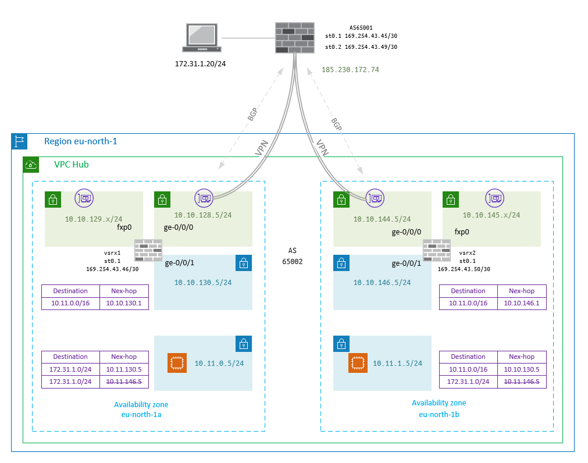

# Deploy vSRX on AWS with terraform
Automated deployment of vSRX firewall in HA setup on AWS.

## Deployment scenario description


## Steps to reproduce


### Allow remote SSH access 
The access to SCI over SSH is permitted from specified source addresses defined as variable mymngip used as sources in the security group rule applied to the management fxp0 interface. 


### SRX initial config
The EC2 instances of vSRX appliances are configured with the template [vsrx.tmpl](modules/jnpr_aws_ec2/vsrx.tmpl). The valid template structure has to begin with hash and the keyword junos-config.

```sh
#junos-config
"add valid config there"
```

The variables customizing the configuration is declared in vsrxcfg as list of maps.


